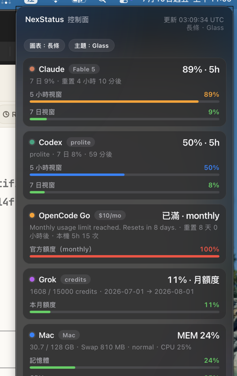

# NexStatus

[](LICENSE)
[](https://github.com/awe7893625/NexStatus)
[](https://awe7893625.github.io/NexStatus/)

**One macOS MenuBar for AI usage + machine load.**

🌐 **Landing page:** https://awe7893625.github.io/NexStatus/  
📦 **Source:** https://github.com/awe7893625/NexStatus

See Claude, Codex, OpenCode Go, Grok, and memory/CPU at a glance — then click for an Apple-style glass panel with **bar or circle** progress, and **switchable color themes**.

```text
C70% G49% K10% M8%
 │    │    │    └─ Memory (when swap / high RAM)
 │    │    └────── K = Grok monthly credits
 │    └─────────── G = Codex (Code) 5h quota
 └──────────────── C = Claude 5h quota
```

<p align="center">
  
</p>

<p align="center">
  <em>macOS MenuBar · Hammerspoon · Python 3 · MIT</em>
</p>

### Styles

| Control (in panel) | Options |
|--------------------|---------|
| **圖表** | `長條` progress bars · `圓圈` ring gauges |
| **主題** | `Glass` · `Paper` · `Mono` · `Nord` |

Prefs are stored locally at `~/.config/nexstatus/prefs.json` (not committed).

---

## Why

AI coding tools each hide usage in a different place. NexStatus unifies them:

| Source | What you see | How |
|--------|----------------|-----|
| **Claude Code** | 5h / 7d % | `~/.claude/usage-status.json` (statusLine hook) |
| **Codex** | 5h / 7d % | `rate_limits` in `~/.codex/sessions/**/*.jsonl` |
| **OpenCode Go** | plan limit status | light probe to `zen/go` + optional local ledger |
| **Grok (xAI)** | monthly credits % | `cli-chat-proxy` billing API via `~/.grok/auth.json` |
| **Mac** | CPU / MEM / Swap | `top`, `memory_pressure`, `sysctl` |

No API keys are written into the status snapshot.

---

## Requirements

- macOS (tested on Apple Silicon; works with MenuBar extras)
- [Hammerspoon](https://www.hammerspoon.org/)
- Python 3.10+ (system `/usr/bin/python3` is enough)
- Optional accounts/tools you already use: Claude Code, Codex, OpenCode Go, Grok CLI

---

## Install

```bash
git clone https://github.com/awe7893625/NexStatus.git
cd NexStatus
./scripts/install.sh
```

The installer:

1. Symlinks `hammerspoon/nexstatus.lua` → `~/.hammerspoon/nexstatus.lua`
2. Appends a load block to `~/.hammerspoon/init.lua`
3. Runs a first snapshot
4. Reloads Hammerspoon when the `hs` CLI is available

Then look at the top-right MenuBar and click the title to open the glass panel.

### Uninstall

Remove the `-- nexstatus:begin` … `-- nexstatus:end` block from `~/.hammerspoon/init.lua`, delete `~/.hammerspoon/nexstatus.lua`, and run:

```bash
hs -c 'if _G.NexStatus then _G.NexStatus.stop() end; hs.reload()'
```

---

## Usage

| Action | How |
|--------|-----|
| Refresh (local) | Automatic ~15s |
| Force Grok + Go remote | Panel **重新整理** / `python3 nexstatus/collector.py --force` |
| Open Stats.app | Panel **Stats** button |
| Dismiss panel | Click outside or **關閉** |

### Environment (optional)

| Variable | Default | Meaning |
|----------|---------|---------|
| `NEXSTATUS_HOME` | install path | Repo root |
| `NEXSTATUS_CACHE` | `~/.cache/nexstatus` | Snapshot + remote caches |
| `NEXSTATUS_COST_DB` | `~/.claude/state/cost.db` | Optional OpenCode Go ledger (if you keep one) |
| `OPENCODE_ZEN_API_KEY` | from `~/.local/share/opencode/auth.json` | OpenCode Go probe |

---

## OpenCode Go limits (upstream)

From [OpenCode Go docs](https://opencode.ai/docs/go/#usage-limits):

- **5 hour** — $12 of usage  
- **Weekly** — $30  
- **Monthly** — $60  
- Subscription — **$10/mo** flat-rate  

When the API returns `GoUsageLimitError`, NexStatus shows **Go100** and the limit name (e.g. monthly). Local ledger dollars are approximate and often undercount cache tokens.

---

## Project layout

```text
NexStatus/
├── README.md
├── LICENSE                 # MIT
├── CONTRIBUTING.md
├── nexstatus/
│   ├── __init__.py
│   └── collector.py        # metrics → JSON
├── hammerspoon/
│   └── nexstatus.lua       # MenuBar + glass UI
└── scripts/
    └── install.sh
```

---

## Privacy & security

- Collector never writes API keys into `~/.cache/nexstatus/status.json`
- Grok / OpenCode tokens are read from existing local auth files or env vars
- Host metrics stay on-device
- Remote probes are cached (Grok ~5m, OpenCode Go ~5–15m) to avoid hammering APIs
- OpenCode workspace URLs in error messages are redacted before cache/display
- Full notes: [docs/SECURITY.md](docs/SECURITY.md)

---

## Roadmap ideas

- [ ] Optional native Swift MenuBar (no Hammerspoon)
- [ ] Gemini / Cursor usage adapters
- [ ] English UI locale toggle
- [ ] Homebrew formula

PRs welcome — see [CONTRIBUTING.md](CONTRIBUTING.md).

---

## License

[MIT](LICENSE)

---

## Name

**NexStatus** — next-gen status for the AI tooling stack, in your MenuBar.
